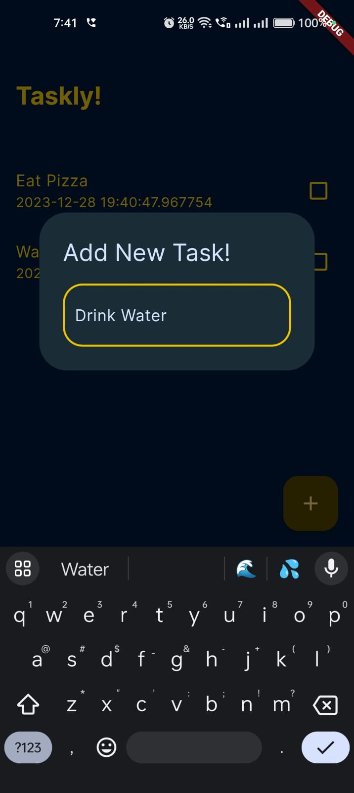

# tasker

The Minimalistic To-Do App.

## Getting Started

Tasker is a light-weight and minimal To-Do App to keep track of your everyday tasks.

## How To Use

- Click on the '+' button to add a new task
- Click on a task to mark it as done or pending
- Long Press on a task to delete.

## Screenshots

<table>
  <tr>
    <td>Main UI: </td>
     <td>Add New Task: </td>
     <td>After New Task: </td>
  </tr>
  <tr>
    <td></td>
    <td></td>
    <td></td>
  </tr>
 </table>
 
